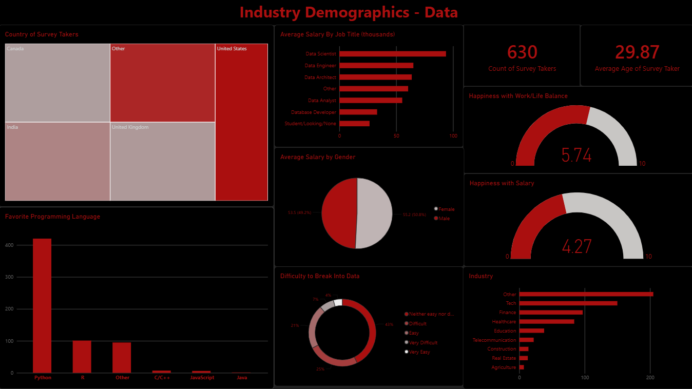

# Power BI Workforce Survey Dashboard

Interactive Power BI dashboard analyzing a survey of **630 professionals in the data industry**, providing an overview of workforce demographics, careers, salaries, programming language preferences, and job satisfaction.

## Project Overview

The dashboard was created to provide a high-level view of the data industry workforce and explore questions such as:

* Who participated in the survey?
* What roles and industries do they work in?
* Which programming languages are most popular?
* How do salaries compare across demographics?
* How difficult do professionals find it to break into the data industry?
* How satisfied are they with their salary and work-life balance?

The average age of survey respondents was approximately **30 years old**.

## Dataset

The dataset contains demographic and professional information, including:

* Age
* Gender
* Country
* Salary
* Job title
* Industry
* Favorite programming language
* Job satisfaction
* Work-life balance
* Perceived difficulty of breaking into the data industry

The dataset was relatively clean overall. However, **job titles and industries contained a large number of scattered categories**. To keep the dashboard focused on the overall picture rather than detailed category-level analysis, less frequent categories were grouped into **"Others"** where appropriate.

## Key Findings

* **43%** of respondents considered breaking into the data industry **neither easy nor difficult**.
* **25%** considered it **difficult**, while **21%** considered it **easy**.
* Average salary was slightly higher among **female respondents ($55.2K)** compared with **male respondents ($53.5K)**.
* **Python and R** were the most popular favorite programming languages.
  *Note: SQL was not considered a programming language for this analysis.*
* The most represented industries were **Technology, Finance, and Healthcare**.
* Average happiness with **salary was 4.27/10**, compared with **5.74/10** for work-life balance.
* Common job titles included **Data Scientist, Data Engineer, Data Architect, and Data Analyst**.

## Dashboard

### Overview

## Tools Used

* **Power BI** — Data visualization, dashboard development, and interactive analysis
* **Power Query** — Data preparation and transformation
* **Excel/CSV** — Dataset

## Project Objective

The goal of this project was to transform survey data into an **interactive and easy-to-understand dashboard** that highlights the demographics, career characteristics, salary patterns, and satisfaction levels of professionals working in the data industry.
